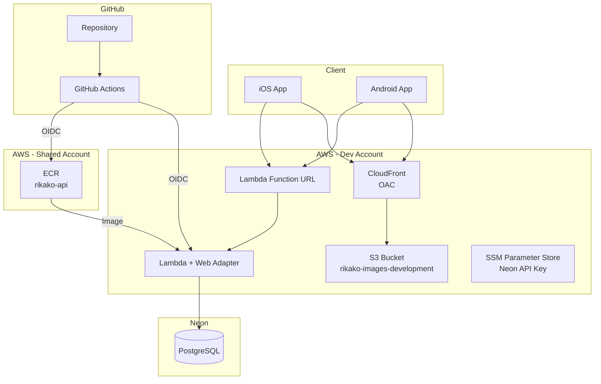
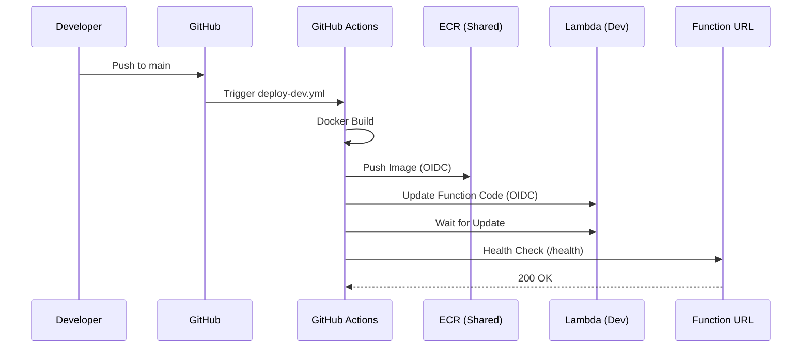
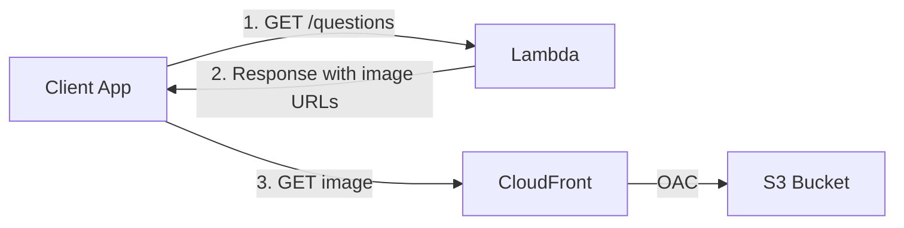
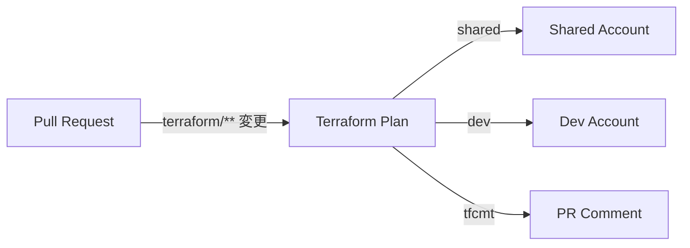

# アーキテクチャ

## 全体構成

## デプロイフロー

## 画像配信

APIは問題レスポンスの `images` フィールドに画像の完全URL（`https://xxx.cloudfront.net/uuid.png`）を返します。
クライアントはそのURLに直接アクセスして画像を取得します。

## Terraform CI

PRで `terraform/` 以下のファイルが変更されると、自動的に `terraform plan` が実行され、結果がPRにコメントされます。

## インフラ構成

| リソース | 用途 | 環境 |
|---------|------|------|
| Lambda + Web Adapter | API サーバー | Dev |
| Lambda Function URL | HTTP エンドポイント | Dev |
| Neon PostgreSQL | データベース | External |
| S3 | 画像ストレージ | Dev |
| CloudFront (OAC) | 画像 CDN | Dev |
| ECR | コンテナレジストリ | Shared |
| SSM Parameter Store | シークレット管理 | Dev |
| S3 | Terraform State | Shared / Dev |

## Terraform モジュール

モジュールはリソースのラッパーとして設計されています。

| モジュール | 内容 |
|-----------|------|
| `modules/s3` | S3 バケット + パブリックアクセスブロック |
| `modules/cloudfront` | CloudFront ディストリビューション + OAC |
| `modules/lambda` | Lambda + IAM Role + CloudWatch Logs + Function URL |
| `modules/ecr` | ECR リポジトリ + ライフサイクルポリシー |

環境レベルで組み合わせて使用します（例: `dev/image_cdn.tf` で `s3` + `cloudfront` を組み合わせ）。
