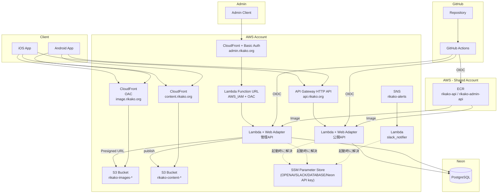
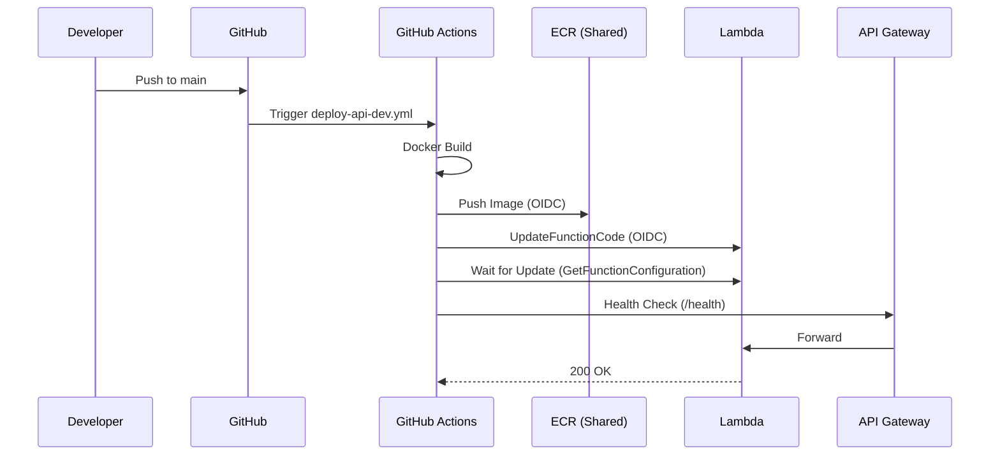
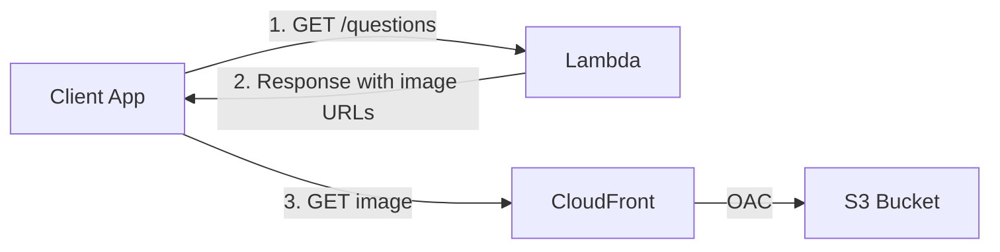
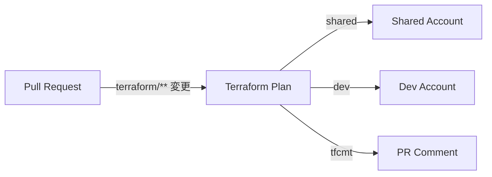
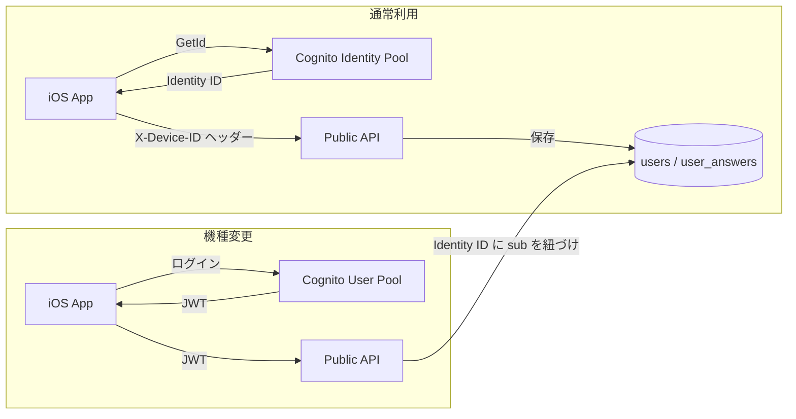

# アーキテクチャ

## 全体構成

> **シークレットの扱い**: Lambda 環境変数には実値を持たず `ssm:/path` 形式の参照だけを設定し、アプリ起動時に `app/internal/secrets.Resolve` が SSM Parameter Store から実値を取得して `os.Setenv` で展開する（Python slack_notifier も同じ規約）。`aws lambda update-function-code` のレスポンス経由でシークレットが露出することを防ぐ仕組み。詳細は [Issue #199](https://github.com/takoikatakotako/rikako/issues/199) 参照。

## デプロイフロー

## 画像配信

APIは問題レスポンスの `images` フィールドに画像の完全URL（`https://xxx.cloudfront.net/uuid.png`）を返します。
クライアントはそのURLに直接アクセスして画像を取得します。

## Terraform CI

PRで `terraform/` 以下のファイルが変更されると、自動的に `terraform plan` が実行され、結果がPRにコメントされます。

## 認証方針

普段は**匿名認証（Cognito Identity Pool）**でユーザー登録なしに利用できる。機種変更時は**ログイン（Cognito User Pool）**してデータを引き継ぐ。

- **Identity ID**: Cognito Identity Pool から取得される匿名ユーザー識別子。Keychainに永続化
- **回答履歴**: `POST /answers` でクイズ完了時にサーバーに送信、`user_answers` テーブルに保存
- **間違えた問題**: `GET /users/me/wrong-answers` で最新回答が不正解の問題を取得

## 管理API

管理APIは公開APIとは別のLambda関数として動作します。詳細は [管理API設計](admin-api.md) を参照。

- **エントリーポイント**: `app/cmd/admin/main.go`
- **OpenAPI仕様**: `openapi-admin.yaml`
- **機能**: 問題・問題集のCRUD、画像Presigned URL発行
- **デプロイ**: Lambda + Lambda Web Adapter（公開APIと同じパターン）

## インフラ構成

| リソース | 用途 | 環境 |
|---------|------|------|
| Lambda + Web Adapter | 公開APIサーバー / 管理APIサーバー | Dev / Prod |
| API Gateway HTTP API | 公開APIエンドポイント (`api.dev.rikako.org` / `api.rikako.org`) | Dev / Prod |
| Lambda Function URL + CloudFront (OAC) | 管理APIエンドポイント (`admin.dev.rikako.org/api` / `admin.rikako.org/api`) | Dev / Prod |
| Neon PostgreSQL | データベース | External (ap-southeast-1) |
| S3 + CloudFront (OAC) | 画像 CDN (`image.dev.rikako.org` / `image.rikako.org`) | Dev / Prod |
| S3 + CloudFront | コンテンツ CDN (`content.dev.rikako.org` / `content.rikako.org`) | Dev / Prod |
| ECR | コンテナレジストリ (`rikako-api`, `rikako-admin-api`) | Shared |
| SSM Parameter Store | シークレット管理 (`OPENAI_API_KEY` / `SLACK_WEBHOOK_URL` / `DATABASE_URL` / Neon API key) | Dev / Prod |
| SNS + Lambda (Python) | CloudWatch アラーム → Slack 通知 | Dev / Prod |
| Cognito User Pool / Identity Pool | 認証（永続）/ 匿名認証 | Dev / Prod |
| S3 | Terraform State | Shared / Dev / Prod |

## Terraform モジュール

モジュールはリソースのラッパーとして設計されています。

| モジュール | 内容 |
|-----------|------|
| `modules/s3` | S3 バケット + パブリックアクセスブロック |
| `modules/cloudfront` | CloudFront ディストリビューション + OAC |
| `modules/lambda` | Lambda + IAM Role + CloudWatch Logs + Function URL (optional) + SSM 読み取りポリシー (optional) |
| `modules/api_gateway` | API Gateway HTTP API + カスタムドメイン + スロットリング |
| `modules/ecr` | ECR リポジトリ + ライフサイクルポリシー |
| `modules/cognito` | Cognito User Pool + Client |
| `modules/cognito_identity` | Cognito Identity Pool + IAM Role (unauthenticated) |

環境レベルで組み合わせて使用します（例: `dev/image_cdn.tf` で `s3` + `cloudfront` を組み合わせ）。
