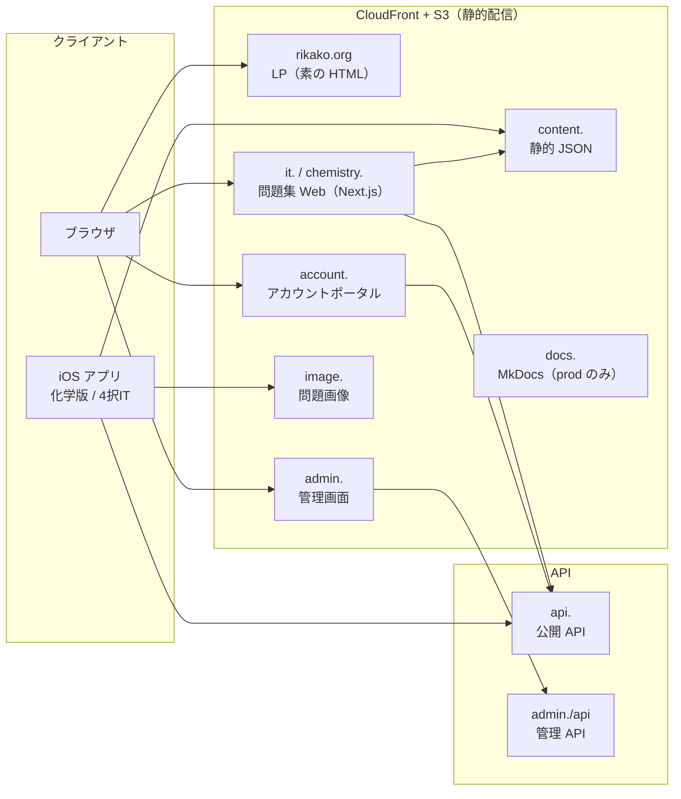
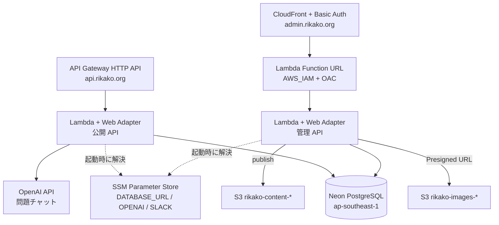
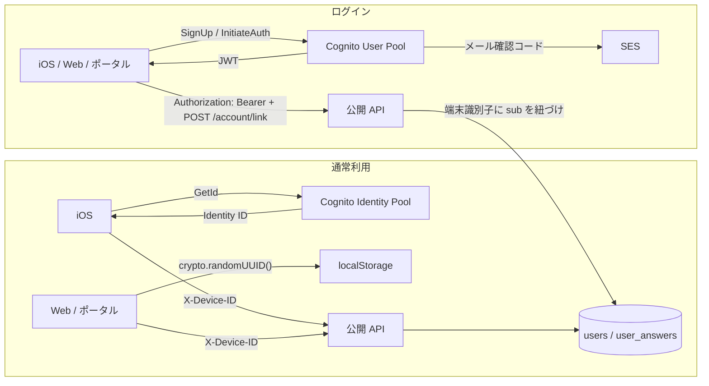
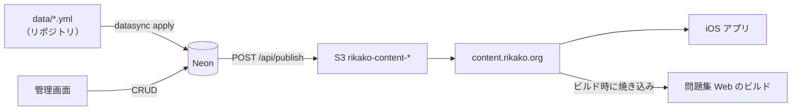
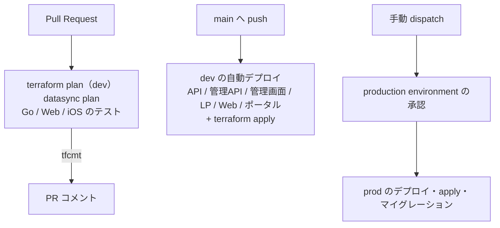
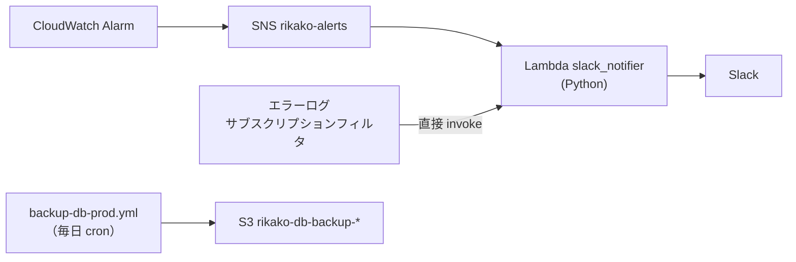

# アーキテクチャ

Rikako は 1 つのリポジトリに **iOS アプリ / 4 種類の Web / 2 つの API / データ** が同居する
モノレポ。AWS 上では dev（197865631794）と prod（211125415945）の 2 アカウントに、
ほぼ同じ構成を並べている。

図が大きくなるため関心ごとに分けている。

## 1. クライアントと配信ドメイン

```mermaid
graph LR
    subgraph クライアント
        iOS["iOS アプリ<br/>化学版 / 4択IT"]
        Browser[ブラウザ]
    end

    subgraph "CloudFront + S3（静的配信）"
        LP["rikako.org<br/>LP（素の HTML）"]
        Web["it. / chemistry.<br/>問題集 Web（Next.js）"]
        Portal["account.<br/>アカウントポータル"]
        AdminFE["admin.<br/>管理画面"]
        ImageCDN["image.<br/>問題画像"]
        ContentCDN["content.<br/>静的 JSON"]
        DocsCDN["docs.<br/>MkDocs（prod のみ）"]
    end

    subgraph API
        PublicAPI["api.<br/>公開 API"]
        AdminAPI["admin./api<br/>管理 API"]
    end

    iOS --> ContentCDN
    iOS --> ImageCDN
    iOS --> PublicAPI
    Browser --> LP
    Browser --> Web
    Browser --> Portal
    Browser --> AdminFE
    Web --> PublicAPI
    Web --> ContentCDN
    Portal --> PublicAPI
    AdminFE --> AdminAPI
```

- **iOS アプリは問題データを公開 API から取らない。** `content.` の静的 JSON を読む
  （[コンテンツ配信](#4-データの流れ)）。公開 API は回答送信・学習記録・お知らせなど動的なものだけ。
- **問題集 Web も静的**。Next.js の静的エクスポートで、ビルド時に `content.` の JSON を焼き込む。
  `web/` 1 つを `NEXT_PUBLIC_SITE` で it / chemistry に出し分ける。
- **dev は LP / Web / ポータル / 管理画面が Basic 認証**（CloudFront Function）。prod は
  管理画面のみ Basic 認証で、他は一般公開。
- prod の `docs.rikako.org` だけ dev に対応物が無い。

## 2. バックエンド

```mermaid
graph TB
    APIGW["API Gateway HTTP API<br/>api.rikako.org"]
    Lambda["Lambda + Web Adapter<br/>公開 API"]
    AdminCF["CloudFront + Basic Auth<br/>admin.rikako.org"]
    AdminFURL["Lambda Function URL<br/>AWS_IAM + OAC"]
    AdminLambda["Lambda + Web Adapter<br/>管理 API"]
    ImageS3["S3 rikako-images-*"]
    ContentS3["S3 rikako-content-*"]
    SSM["SSM Parameter Store<br/>DATABASE_URL / OPENAI / SLACK"]
    OpenAI["OpenAI API<br/>問題チャット"]
    DB[("Neon PostgreSQL<br/>ap-southeast-1")]

    APIGW --> Lambda
    AdminCF --> AdminFURL --> AdminLambda
    Lambda --> DB
    AdminLambda --> DB
    Lambda -.->|起動時に解決| SSM
    AdminLambda -.->|起動時に解決| SSM
    Lambda --> OpenAI
    AdminLambda -->|Presigned URL| ImageS3
    AdminLambda -->|publish| ContentS3
```

> **シークレットの扱い**: Lambda 環境変数には実値を持たず `ssm:/path` 形式の参照だけを設定し、
> 起動時に `app/internal/secrets.Resolve` が SSM から実値を取得して `os.Setenv` で展開する
> （Python の slack_notifier も同じ規約）。`aws lambda update-function-code` のレスポンス経由で
> シークレットが露出することを防ぐ（[Issue #199](https://github.com/takoikatakotako/rikako/issues/199)）。

> **DB 接続**: 公開 API / 管理 API の Lambda は Neon の pooled endpoint を使う。datasync と
> マイグレーションは direct。詳細は [runbook](runbook.md#neon-pooling)。

## 3. 認証

普段は**登録なしの匿名利用**で、機種変更などでデータを引き継ぎたいときだけ
**メールログイン（Cognito User Pool）**する（Issue #283）。

匿名時の端末識別子はクライアントで出どころが違う。**iOS は Cognito Identity Pool の
Identity ID**、**Web とポータルは `crypto.randomUUID()` で生成した UUID**（Identity Pool は
呼ばない）。どちらも `X-Device-ID` ヘッダで送り、サーバーは `identity_id` として扱う。

```mermaid
graph LR
    subgraph 通常利用
        IOS1[iOS] -->|GetId| CIP[Cognito Identity Pool]
        CIP -->|Identity ID| IOS1
        WEB1["Web / ポータル"] -->|"crypto.randomUUID()"| LS[localStorage]
        IOS1 -->|X-Device-ID| API[公開 API]
        WEB1 -->|X-Device-ID| API
        API --> DB[("users / user_answers")]
    end

    subgraph ログイン
        App2["iOS / Web / ポータル"] -->|SignUp / InitiateAuth| CUP[Cognito User Pool]
        CUP -->|メール確認コード| SESx[SES]
        CUP -->|JWT| App2
        App2 -->|"Authorization: Bearer + POST /account/link"| API2[公開 API]
        API2 -->|端末識別子に sub を紐づけ| DB
    end
```

- **端末識別子（`X-Device-ID`）の出どころはクライアントで違う**。iOS は Cognito Identity Pool の
  Identity ID を Keychain に永続化する。Web とポータルは Identity Pool を呼ばず、
  `crypto.randomUUID()` で生成した UUID を localStorage に持つ（`src/lib/deviceId.ts`）。
  サーバーは `identity_id` として受け取るだけなので、どちらでも同じように扱える
- **メールログインは iOS / Web / ポータルのいずれからでもできる**。Web は `src/lib/cognito.ts` と
  `(auth)` 配下で User Pool を直叩きしている
- **`POST /account/link`**: ログイン中の Cognito ユーザーに、いま使っている端末識別子の
  学習記録を紐づける
- サーバー側は JWT 検証のみ（`app/internal/auth/`）。JWKS は kid 単位でキャッシュ（TTL 1 時間）
- 環境変数が未設定なら認証をスキップする（ローカル開発・CI 用）

設計の詳細は [メールログイン設計](email-login-design.md) を参照。

## 4. データの流れ

問題データは **YAML が source of truth**。DB を経由して静的 JSON になり、CDN から配信される。

```mermaid
graph LR
    YAML["data/*.yml<br/>（リポジトリ）"] -->|datasync apply| DB[("Neon")]
    Admin["管理画面"] -->|CRUD| DB
    DB -->|"POST /api/publish"| S3["S3 rikako-content-*"]
    S3 --> CF["content.rikako.org"]
    CF --> iOS[iOS アプリ]
    CF -->|ビルド時に焼き込み| WebBuild["問題集 Web のビルド"]
```

**web はビルド時に焼き込むため、公開内容を変えたら `/publish` の後に web を再デプロイする**
必要がある。詳しくは [データ同期](datasync.md) と [runbook](runbook.md)。

画像は別系統で、API が返す `images` にフル URL（`https://image.rikako.org/<uuid>.png`）が入り、
クライアントが直接 CloudFront から取得する。

## 5. デプロイと CI

```mermaid
graph TB
    PR[Pull Request] --> Plan["terraform plan（dev）<br/>datasync plan<br/>Go / Web / iOS のテスト"]
    Plan -->|tfcmt| Comment[PR コメント]
    Main["main へ push"] --> DevAuto["dev の自動デプロイ<br/>API / 管理API / 管理画面 / LP / Web / ポータル<br/>+ terraform apply"]
    Manual["手動 dispatch"] --> ProdApprove["production environment の承認"]
    ProdApprove --> ProdDeploy["prod のデプロイ・apply・マイグレーション"]
```

- **dev**: `main` への push で、変更のあった領域だけが自動デプロイされる（各ワークフローの
  `paths` で判定。ワークフローファイル自身も `paths` に含める）
- **prod**: アプリのデプロイ・Terraform apply・マイグレーションは手動 dispatch +
  `production` environment の承認ゲート。**ただしドキュメント（`docs.yml`）は例外**で、
  `main` への push で prod アカウントの `rikako-docs` へ承認なしに自動デプロイされる
- **Terraform**: dev は `apply-terraform-dev.yml` が自動 apply。prod は
  `apply-terraform-prod.yml`（plan → 承認 → apply）
- **認証**: GitHub Actions OIDC。AWS のアクセスキーは持たない
- **ECR**: `rikako-api` / `rikako-admin-api` は shared アカウント（579039992557）にあるが、
  **その IaC は別リポジトリ `aws-iac` が管理する**。このリポジトリは pull で参照し、push は
  `rikako-ecr-push` ロールを使うだけ

コンテナのデプロイは「ECR に build & push → Lambda のコード更新 → ヘルスチェック」の 3 段。

## 6. 監視とバックアップ

```mermaid
graph LR
    Alarm[CloudWatch Alarm] --> SNS["SNS rikako-alerts"]
    SNS --> Notifier["Lambda slack_notifier<br/>(Python)"]
    Logs["エラーログ<br/>サブスクリプションフィルタ"] -->|直接 invoke| Notifier
    Notifier --> Slack[Slack]
    Backup["backup-db-prod.yml<br/>（毎日 cron）"] --> BackupS3["S3 rikako-db-backup-*"]
```

- アラームは SNS 経由、エラーログのサブスクリプションフィルタは slack_notifier を直接 invoke する
- prod には CloudWatch ダッシュボード（`cloudwatch.tf`）がある
- DB バックアップは prod のみ。手順は [DBバックアップとリストア](db-backup.md)

## 7. インフラ構成

| リソース | 用途 | 環境 |
|---------|------|------|
| Lambda + Web Adapter | 公開 API / 管理 API | dev / prod |
| API Gateway HTTP API | 公開 API（`api.dev.rikako.org` / `api.rikako.org`） | dev / prod |
| Lambda Function URL + CloudFront (OAC) | 管理 API（`admin.<env>/api`） | dev / prod |
| S3 + CloudFront | LP / 問題集 Web（it・chemistry）/ ポータル / 管理画面 | dev / prod |
| S3 + CloudFront (OAC) | 画像 CDN（`image.`） | dev / prod |
| S3 + CloudFront | コンテンツ CDN（`content.`） | dev / prod |
| S3 + CloudFront | ドキュメント（`docs.rikako.org`） | prod のみ |
| Neon PostgreSQL | データベース（ap-southeast-1） | dev / prod |
| Cognito User Pool / Identity Pool | メールログイン / 匿名認証 | dev / prod |
| SES | Cognito のメール送信（DKIM・DMARC を Cloudflare に登録） | dev / prod |
| SSM Parameter Store | シークレット（`database-url` / `openai-api-key` / `slack-*-webhook-url` ほか） | dev / prod |
| SNS + Lambda (Python) | CloudWatch アラーム・エラーログ → Slack | dev / prod |
| S3 | DB バックアップ | prod のみ |
| Cloudflare | DNS（`rikako.org` ゾーン） | 共通 |
| ECR | コンテナレジストリ（IaC は `aws-iac` 管理） | shared |
| S3 | Terraform State | dev / prod |

## 8. Terraform モジュール

モジュールはリソースのラッパー。環境レベルで組み合わせて使う（例: `dev/image_cdn.tf` が
`s3` + `cloudfront`）。フロントエンド系のディストリビューションは要件が個別なため、
モジュールを介さず環境側に直接書いている。

| モジュール | 内容 |
|-----------|------|
| `modules/s3` | S3 バケット + パブリックアクセスブロック |
| `modules/cloudfront` | CloudFront ディストリビューション + OAC |
| `modules/lambda` | Lambda + IAM Role + CloudWatch Logs + Function URL (optional) + SSM 読み取りポリシー (optional) |
| `modules/api_gateway` | API Gateway HTTP API + カスタムドメイン + スロットリング |
| `modules/cognito` | Cognito User Pool + Client |
| `modules/cognito_identity` | Cognito Identity Pool + IAM Role (unauthenticated) |
