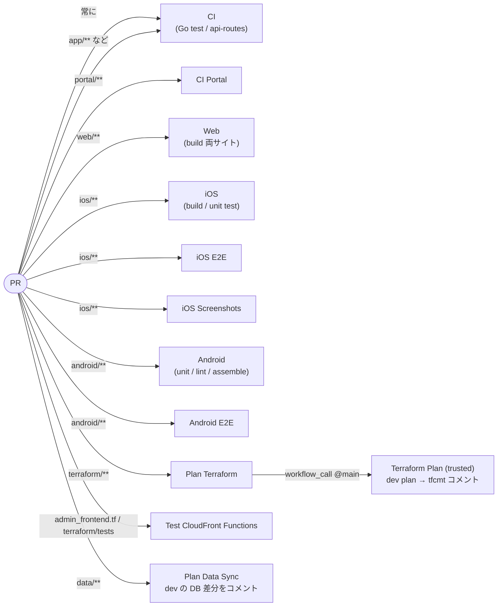
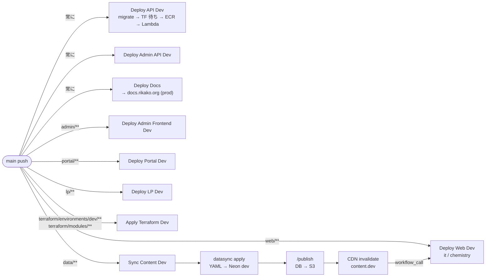
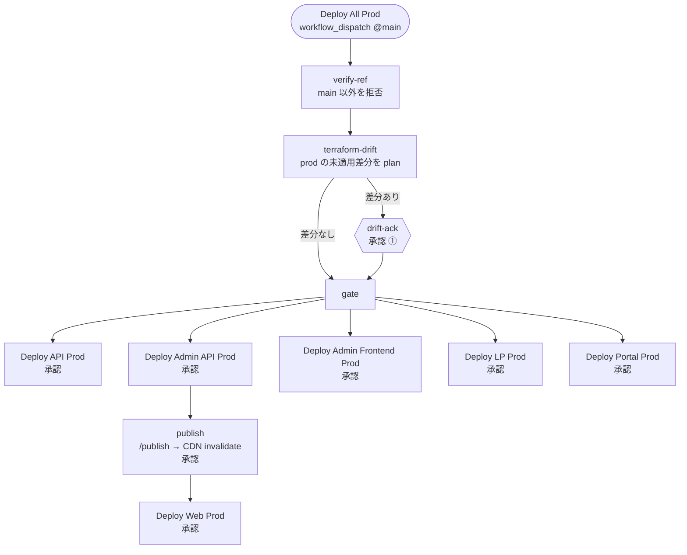
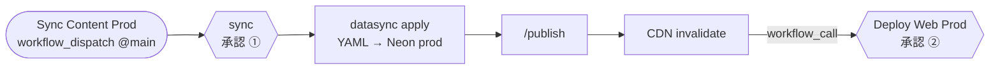
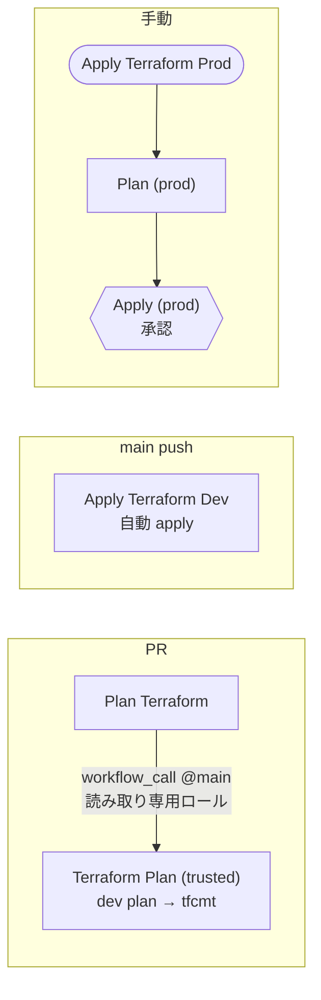
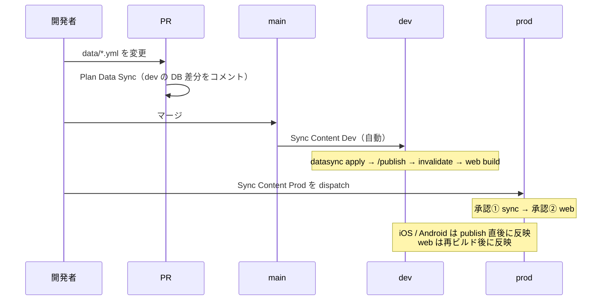

# CI / CD ワークフロー全体図

`.github/workflows/` の 35 本がどう繋がっているかの地図。個々の手順は各ワークフローのコメントと
[runbook](runbook.md) を参照。

## 原則

| | dev | prod |
|---|---|---|
| **起動** | main に push されたら自動（`paths` で領域判定） | 手動 `workflow_dispatch`（main からのみ） |
| **承認** | なし | GitHub Environment `production` の required reviewers |
| **例外** | — | `docs.yml` だけは main push で prod（docs.rikako.org）へ自動 |

- **prod の承認は environment を使う job ごと**に要る。1 つの run に複数の prod job があれば、その数だけ承認クリックがある
- 共有ロール `rikako-development-github-actions` / `rikako-production-github-actions` の OIDC 信頼は **main の workflow に限定**（#370）。ブランチから dispatch しても AWS 認証で落ちる
- PR から AWS 認証付きで動くのは `plan-terraform`（読み取り専用ロール、実処理は main 固定の `terraform-plan-trusted`）と `plan-datasync`（SSM 読み取りだけの専用ロール）の 2 つだけ

## 1. PR を出したとき（テスト・plan）

変更した領域に応じて走る。すべて読み取り専用で、承認は無い。

> `CI` は `paths` 指定なしで全 PR に走る（Go のテストと API ルートの整合チェック）。

## 2. main にマージされたとき（dev への自動反映）

- `Deploy API Dev` / `Deploy Admin API Dev` / `Deploy Docs` は `paths` を絞っていないので、**main への push があれば毎回**動く
- `Sync Content Dev` は「データ反映の順序」を強制するためのもの。web は静的エクスポートでビルド時に content CDN の JSON を焼き込むため、publish → invalidate の**後**にビルドしないと古い内容が出る（#391）
- **Deploy API Dev は migration → 同一コミットの Apply Terraform Dev 待ち → Lambda 更新** の順で動く（#408）。新しいコードが要求するテーブルや IAM が先に無いと更新直後の Lambda が既存エンドポイントごと壊れるため。`migrate-dev.yml` を `workflow_call` で呼ぶので、dev の migration は手動 dispatch 不要（未適用が無ければ no change）。prod は手動: Run Database Migration (Prod) → Apply Terraform Prod → Deploy API Prod

## 3. prod へ出すとき（手動 + 承認）

### 3-1. まとめて出す: Deploy All Prod

アプリのコードを含む本番リリースはこれ 1 本。**順序の強制が主目的**。

- API / ポータル / web は各ワークフロー内で、管理API + 管理画面はまとめて 1 つ、GitHub Release（`<prefix>/<日時>` タグ、例 `api-prod/20260912-002156`）を作って「何をいつ出したか」を残す
- 呼ばれる `Deploy * Prod` はすべて `workflow_call` 対応の reusable workflow で、**単体でも dispatch できる**（ロールバックは各ワークフローの `checkout_ref` で）
- ポータルは実行時に API を叩くので publish を待たない。web だけが publish の後
- publish + invalidate は `.github/actions/publish-content`（composite action）。`Sync Content Prod` と共通

### 3-2. データだけ出す: Sync Content Prod

`data/` の変更だけを反映したいとき。Deploy All Prod と同じ順序で、対象を DB → S3 → web に絞ったもの。

### 3-3. 単体で出すもの

| ワークフロー | 用途 | 備考 |
|---|---|---|
| **Deploy Admin Prod** | 管理API + 管理画面をまとめて | `deploy-admin-api-prod` と `deploy-admin-frontend-prod` を `workflow_call` |
| **Deploy Android Prod** | Play Console へ AAB | flavor / track / status を選ぶ。`google-services.json` は SSM から取得（#235） |
| **Deploy API Prod** / **Deploy Admin API Prod** / **Deploy Admin Frontend Prod** / **Deploy LP Prod** / **Deploy Portal Prod** / **Deploy Web Prod** | 個別デプロイ・ロールバック | 通常は Deploy All Prod 経由。`checkout_ref` で過去の main コミットに戻せる |
| **Run Database Migration (Prod)** | マイグレーション | up / down とステップ数を指定。承認あり |
| **Apply Terraform Prod** | インフラ | 次節 |

iOS は CI からデプロイしない（Xcode から手動で Archive → App Store Connect）。

## 4. Terraform

- PR の plan は **dev だけ**。prod の plan は Apply Terraform Prod の中で見る（承認前に Summary に出る）
- Deploy All Prod は先頭で prod の未適用差分を検知する（`terraform-drift`）。「コードは main にあるがインフラが apply されていない」状態で部分反映になるのを防ぐ
- 実処理を main 固定の `terraform-plan-trusted.yml` に委譲しているのは、PR 側で workflow を書き換えても認証情報が渡らないようにするため（#370）

## 5. コンテンツ配信の全体像（データを変えたとき）

## 6. 定期実行

| ワークフロー | スケジュール | 内容 |
|---|---|---|
| **Backup DB Prod** | 毎日 18:10 UTC（03:10 JST） | prod の Neon を `pg_dump` して S3 へ。失敗は Slack へ（[DBバックアップ](db-backup.md)） |

## 7. 一覧

| ファイル | 名前 | 起動 | 承認 |
|---|---|---|---|
| `ci.yml` | CI | PR / main push | — |
| `ci-portal.yml` | CI Portal | PR / main push（portal） | — |
| `web.yml` | Web | PR / main push（web） | — |
| `ios.yml` | iOS | PR / main push（ios） | — |
| `ios-e2e.yml` | iOS E2E | PR（ios）/ dispatch | — |
| `ios-screenshots.yml` | iOS Screenshots | PR（ios）/ dispatch | — |
| `android.yml` | Android | PR / main push（android） | — |
| `android-e2e.yml` | Android E2E | PR（android）/ dispatch | — |
| `test-cloudfront-functions.yml` | Test CloudFront Functions | PR（admin_frontend.tf / terraform/tests） | — |
| `plan-terraform.yml` | Plan Terraform | PR（terraform） | — |
| `terraform-plan-trusted.yml` | Terraform Plan (trusted) | `workflow_call` のみ | — |
| `plan-datasync.yml` | Plan Data Sync | PR（data）/ dispatch@main | — |
| `deploy-api-dev.yml` | Deploy API Dev | main push / dispatch | — |
| `deploy-admin-api-dev.yml` | Deploy Admin API Dev | main push / dispatch | — |
| `deploy-admin-frontend-dev.yml` | Deploy Admin Frontend Dev | main push（admin）/ dispatch | — |
| `deploy-web-dev.yml` | Deploy Web Dev | main push（web）/ dispatch / call | — |
| `deploy-portal-dev.yml` | Deploy Portal Dev | main push（portal）/ dispatch | — |
| `deploy-lp-dev.yml` | Deploy LP Dev | main push（lp）/ dispatch | — |
| `sync-content-dev.yml` | Sync Content Dev | main push（data）/ dispatch@main | — |
| `apply-terraform-dev.yml` | Apply Terraform Dev | main push（terraform dev/modules）/ dispatch | — |
| `migrate-dev.yml` | Run Database Migration (Dev) | dispatch / call（Deploy API Dev から） | — |
| `docs.yml` | Deploy Docs | main push / dispatch | —（prod へ自動） |
| `deploy-all-prod.yml` | Deploy All Prod | dispatch@main | production（複数） |
| `deploy-admin-prod.yml` | Deploy Admin Prod | dispatch | production（呼び先） |
| `deploy-api-prod.yml` | Deploy API Prod | dispatch / call | production |
| `deploy-admin-api-prod.yml` | Deploy Admin API Prod | dispatch / call | production |
| `deploy-admin-frontend-prod.yml` | Deploy Admin Frontend Prod | dispatch / call | production |
| `deploy-web-prod.yml` | Deploy Web Prod | dispatch / call | production |
| `deploy-portal-prod.yml` | Deploy Portal Prod | dispatch / call | production |
| `deploy-lp-prod.yml` | Deploy LP Prod | dispatch / call | production |
| `deploy-android-prod.yml` | Deploy Android Prod | dispatch@main | production |
| `sync-content-prod.yml` | Sync Content Prod | dispatch@main | production ×2 |
| `apply-terraform-prod.yml` | Apply Terraform Prod | dispatch | production |
| `migrate-prod.yml` | Run Database Migration (Prod) | dispatch | production |
| `backup-db-prod.yml` | Backup DB Prod | cron / dispatch | — |
