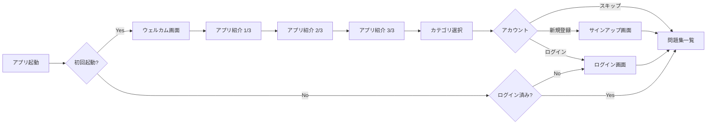
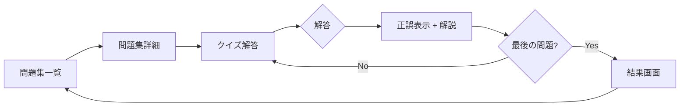
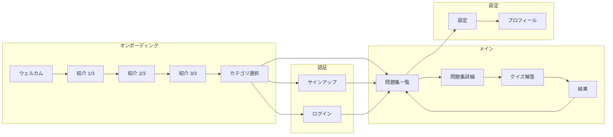

# iOS アプリ

## 画面遷移図

### オンボーディングフロー

### メインフロー

### 全体画面一覧

## 画面詳細

| 画面 | 状態 | 説明 |
|------|------|------|
| ウェルカム | 実装済み | 初回起動時のウェルカム画面 |
| アプリ紹介 (1-3) | 実装済み | アプリの機能紹介スライド |
| カテゴリ選択 | 実装済み | 学習カテゴリの選択（中学理科・化学基礎・化学・大学一般化学） |
| サインアップ | 実装済み | メール+パスワード（モック） |
| ログイン | 実装済み | メール+パスワード（モック） |
| 問題集一覧 | 実装済み | 問題集のリスト表示（タイトル、説明、問題数） |
| 問題集詳細 | 実装済み | 問題リスト + 「この問題集を解く」ボタン |
| クイズ解答 | 実装済み | 問題文 + 選択肢、正誤表示 + 解説 |
| 結果 | 実装済み | スコア、正誤一覧、一覧に戻る |
| 設定 | 実装済み | カテゴリ変更、アカウント情報、学習統計、ログアウト |
| プロフィール | 実装済み | ユーザー情報、学習記録 |
