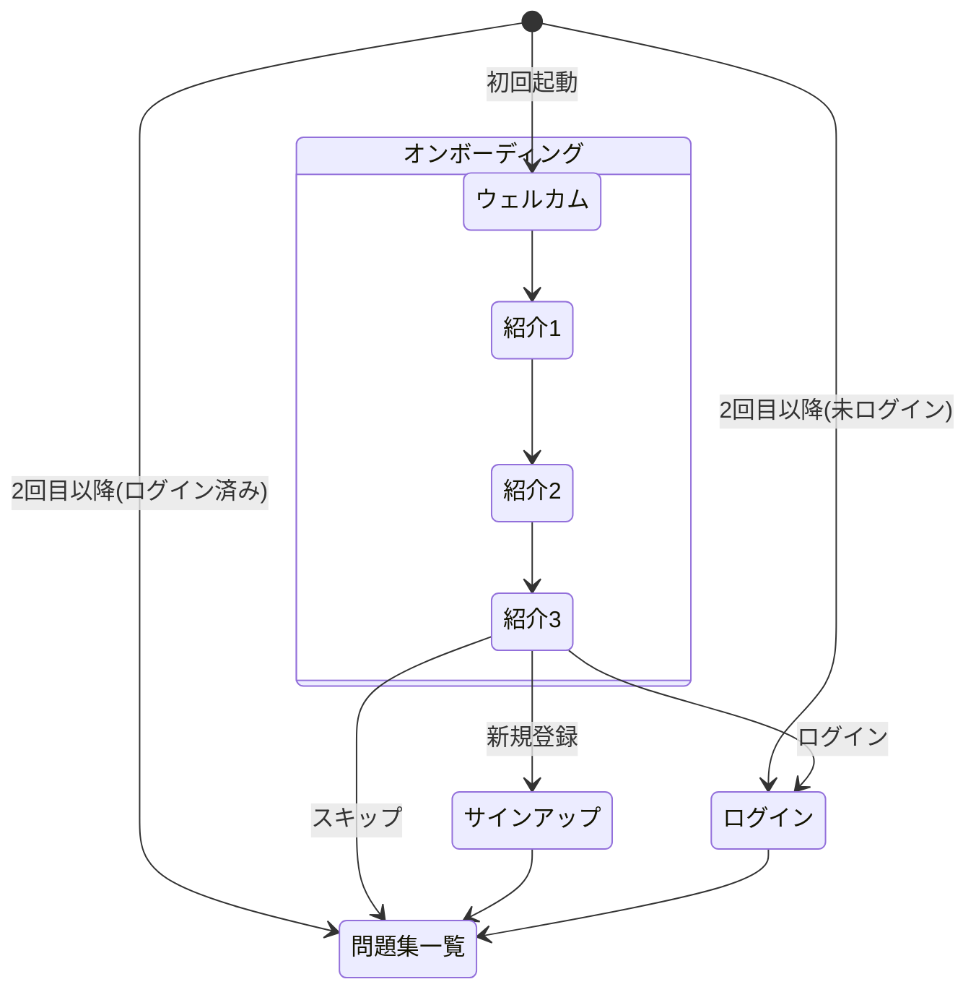
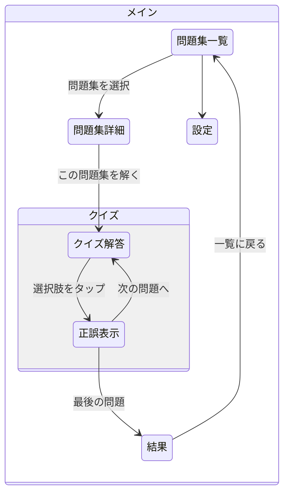

# iOS アプリ

## 画面遷移図

### オンボーディングフロー



### メインフロー



### 全体画面遷移

```mermaid
stateDiagram-v2
    direction LR

    state オンボーディング {
        ウェルカム --> 紹介1 --> 紹介2 --> 紹介3
    }

    state 認証 {
        サインアップ
        ログイン
    }

    state メイン {
        問題集一覧 --> 問題集詳細
        問題集詳細 --> クイズ解答
        クイズ解答 --> 結果
        結果 --> 問題集一覧
        問題集一覧 --> 設定
        設定 --> プロフィール
    }

    [*] --> オンボーディング: 初回
    [*] --> 認証: 未ログイン
    [*] --> メイン: ログイン済み
    オンボーディング --> 認証
    オンボーディング --> メイン: スキップ
    認証 --> メイン
```

## 画面詳細

| 画面 | 状態 | 説明 |
|------|------|------|
| ウェルカム | 未実装 | 初回起動時のウェルカム画面 |
| アプリ紹介 (1-3) | 未実装 | アプリの機能紹介スライド |
| サインアップ | 未実装 | Cognito連携、メール+パスワード |
| ログイン | 未実装 | Cognito連携 |
| 問題集一覧 | 実装済み | 問題集のリスト表示（タイトル、説明、問題数） |
| 問題集詳細 | 実装済み | 問題リスト + 「この問題集を解く」ボタン |
| クイズ解答 | 実装済み | 問題文 + 選択肢、正誤表示 + 解説 |
| 結果 | 実装済み | スコア、正誤一覧、一覧に戻る |
| 設定 | 未実装 | アカウント、通知、ログアウト等 |
| プロフィール | 未実装 | ユーザー情報、学習履歴 |
