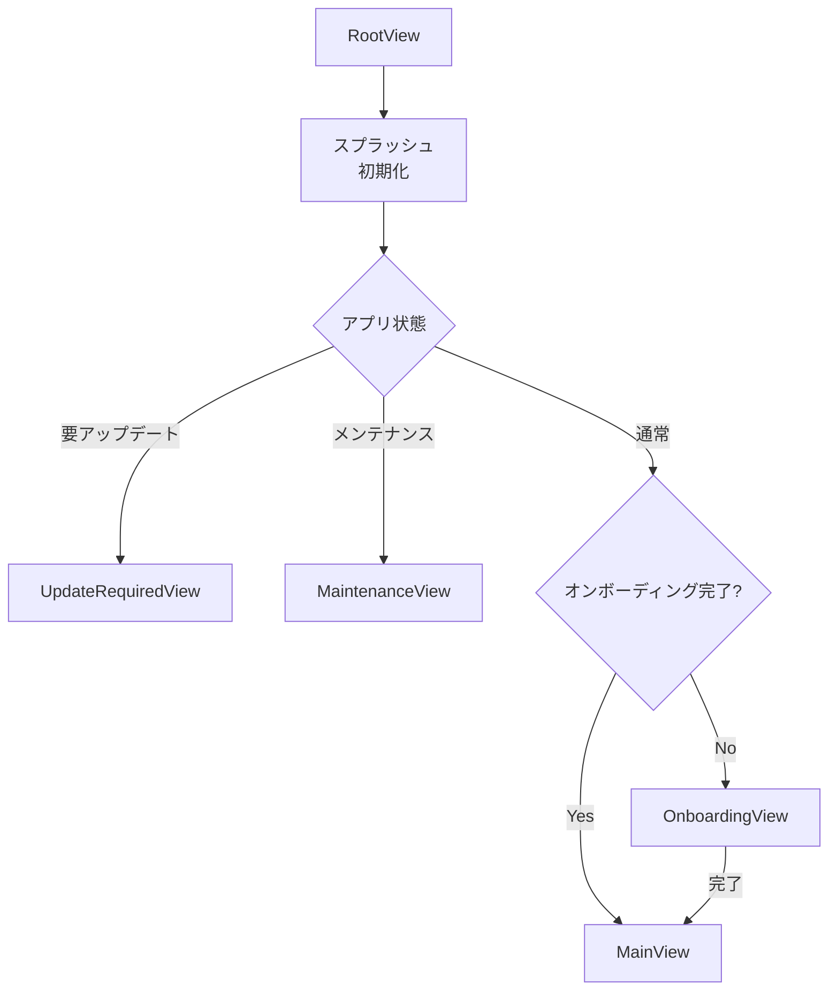
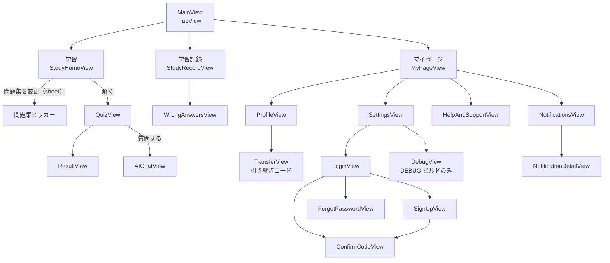

# iOS アプリ

`ios/Rikako` の SwiftUI アプリ。**1 つのコードベースを flavor で出し分けて 2 アプリを配信**
している（化学版 `jp.conol.chemist` / 4択IT `org.rikako.it-passport`）。

レイヤ構成とディレクトリ責務は [iOS Architecture](ios/architecture.md)、オンボーディングの
画面仕様は [iOS Onboarding](ios/onboarding.md) を参照。

## 起動フロー

`RootView` が起動時にアプリ状態を取得し、強制アップデート・メンテナンス・通常を出し分ける。


```mermaid
flowchart TD
    A[RootView] --> B[スプラッシュ<br/>初期化]
    B --> C{アプリ状態}
    C -->|要アップデート| D[UpdateRequiredView]
    C -->|メンテナンス| E[MaintenanceView]
    C -->|通常| F{オンボーディング完了?}
    F -->|No| G[OnboardingView]
    F -->|Yes| H[MainView]
    G -->|完了| H
```

- アプリ状態は公開 API の `GET /status` から取得する（`app_status` テーブル）
- オンボーディング完了フラグは `AppState` が持つ

## メイン画面（3 タブ）

`MainView` は `TabView`。**ログインは起動時には求めず、マイページからの任意操作**。


```mermaid
flowchart TD
    Main[MainView<br/>TabView] --> Study[学習<br/>StudyHomeView]
    Main --> Record[学習記録<br/>StudyRecordView]
    Main --> My[マイページ<br/>MyPageView]

    Study -->|問題集を変更（sheet）| Picker[問題集ピッカー]
    Study -->|解く| Quiz[QuizView]
    Quiz --> Result[ResultView]
    Quiz -->|質問する| AIChat[AIChatView]

    Record --> Wrong[WrongAnswersView]

    My --> Profile[ProfileView]
    My --> Notifications[NotificationsView]
    My --> Help[HelpAndSupportView]
    My --> Settings[SettingsView]

    Profile --> Transfer[TransferView<br/>引き継ぎコード]
    Settings --> Login[LoginView]
    Settings --> Debug[DebugView<br/>DEBUG ビルドのみ]

    Login --> SignUp[SignUpView]
    Login --> Confirm[ConfirmCodeView]
    Login --> Forgot[ForgotPasswordView]
    SignUp --> Confirm
    Notifications --> NotifDetail[NotificationDetailView]
```

## 画面一覧

| 画面 | 到達経路 | 説明 |
|------|----------|------|
| `RootView` | 起動 | 状態に応じて出し分ける入口 |
| `UpdateRequiredView` | Root | 強制アップデート |
| `MaintenanceView` | Root | メンテナンス表示 |
| `OnboardingView` | Root（初回） | 問題集選択を含むオンボーディング |
| `MainView` | Root | 3 タブのコンテナ |
| `StudyHomeView` | タブ | 選択中の問題集と進捗、出題開始 |
| `QuizView` | 学習タブ | 出題・解答・解説 |
| `AIChatView` | Quiz | 問題について質問する（`POST /questions/{id}/chat`） |
| `ResultView` | Quiz | スコアと正誤一覧 |
| `StudyRecordView` | タブ | 学習記録（週次・累計） |
| `WrongAnswersView` | 学習記録 | 間違えた問題の一覧 |
| `MyPageView` | タブ | 各種メニューの入口 |
| `ProfileView` | マイページ | プロフィール |
| `TransferView` | プロフィール | 引き継ぎコードの発行・適用 |
| `NotificationsView` / `NotificationDetailView` | マイページ | お知らせ |
| `HelpAndSupportView` | マイページ | ヘルプ・問い合わせ |
| `SettingsView` | マイページ | 設定 |
| `LoginView` / `SignUpView` / `ConfirmCodeView` / `ForgotPasswordView` | 設定 | メールログイン（#283） |
| `DebugView` / `DebugWorkbooksView` / `DebugLearningLogView` | 設定 | DEBUG ビルドのみ |

## 認証の考え方

普段は Cognito Identity Pool の**匿名認証**のまま使い、機種変更などでデータを引き継ぎたい
ときだけ設定からメールログインする。詳細は [メールログイン設計](email-login-design.md) と
[アーキテクチャ](architecture.md#3-認証)。

引き継ぎ手段は 2 つある。

- **メールログイン**（`POST /account/link`）: アカウントに紐づけて引き継ぐ
- **引き継ぎコード**（`TransferView`、`/transfer/token` と `/transfer/apply`）: アカウント無しで移す

## データの取得元

**問題データは公開 API から取らない。** コンテンツ CDN（`content.rikako.org`）の静的 JSON を
読む。公開 API は回答送信・学習記録・お知らせ・AIチャットなど動的なものを担当する。
詳細は [アーキテクチャ](architecture.md#4-データの流れ)。

## 利用イベント計測（Analytics）

リリース後にオンボーディング離脱や主要機能の成功／失敗率をバージョン別に把握するための計測基盤（[#261](https://github.com/takoikatakotako/rikako/issues/261)）。計測基盤は **Firebase Analytics** を採用（クラッシュ収集 [#235](https://github.com/takoikatakotako/rikako/issues/235) の Crashlytics と統合する方針）。

### アーキテクチャ

計測は差し替え可能な抽象に載せている（`LearningRepository` 等と同じ protocol-first）。

| 種別 | ファイル | 役割 |
|------|----------|------|
| protocol | `Domain/Analytics/AnalyticsClient.swift` | 計測の抽象。`log(_:)` / `setCommonProperties(_:)` |
| イベント | `Domain/Analytics/AnalyticsEvent.swift` | 最小イベントの enum ＋ 失敗理由カテゴリ |
| 実装(Noop) | `Infrastructure/Analytics/NoopAnalyticsClient.swift` | preview / UIテスト用 |
| 実装(Console) | `Infrastructure/Analytics/ConsoleAnalyticsClient.swift` | DEBUG でイベントをコンソール出力 |
| 共通プロパティ | `Infrastructure/Analytics/AnalyticsCommonProperties+Current.swift` | app version/build・app slug・OS version |

`AppContainer` が構築して各 ViewModel に注入（DIしている `OnboardingViewModel`）または `AppContainer.shared.analytics` 経由で発火（service-locator の Quiz/AIChat/Transfer 等）する。

### イベント一覧

`app_open` / `onboarding_started` / `onboarding_step_viewed`(step) / `onboarding_completed` / `workbook_started`(workbook_id) / `workbook_completed`(workbook_id) / `answers_submitted`(workbook_id, count) / `answers_submission_failed`(reason) / `ai_chat_started` / `ai_chat_succeeded` / `ai_chat_failed`(reason) / `transfer_started` / `transfer_completed` / `transfer_failed`(reason)

### プライバシー方針（重要）

- イベントに載せるのは**識別子・件数・カテゴリの非 PII スカラーのみ**。ユーザー入力本文・問題文・メールアドレス・Cognito Identity ID は**絶対に含めない**。
- 失敗は生のエラーメッセージではなく `AnalyticsFailureReason`（`network`/`server`/`decoding`/`cancelled`/`unauthorized`/`unknown`）の有限カテゴリに畳み込む。
- 非 PII であることは `RikakoTests/AnalyticsEventTests.swift` で検証（キーの allowlist・値の型・reason の有限集合）。`PrivacyInfo.xcprivacy` は `ProductInteraction` を宣言済み。

### 実装フェーズ

- **Phase 1（実装済み）**: Firebase 非依存の計測レイヤー＋全イベント発火＋PIIテスト。
- **Phase 2（実装済み・結線）**: `firebase-ios-sdk` を SPM 追加（**`FirebaseAnalytics` 単体**）、`FirebaseAnalyticsClient` 実装、`AppContainer` で環境別に選択。

計測クライアントの選択（`AppContainer`）:

| ビルド | フレーバー | クライアント | 送信先 |
|--------|-----------|-------------|--------|
| DEBUG | dev | `CompositeAnalyticsClient`（`ConsoleAnalyticsClient` + `FirebaseAnalyticsClient`） | コンソール出力 + Firebase `sandbox-492513`（共有 sandbox、GA4 未リンク） |
| Release | prod | `FirebaseAnalyticsClient` | Firebase `rikako-prd` |

`FirebaseAnalyticsClient.configured(slug:environment:)` が `GoogleService-Info-<slug>-<env>.plist` で `FirebaseApp.configure` する。plist が見つからない場合は Firebase 分をスキップ（dev は Console のみ / prod は `NoopAnalyticsClient`）＝クラッシュしない。

Firebase プロジェクトは **dev/prod で分離**（dev データが prod GA4 を汚さないため）:

| 環境 | プロジェクト | 登録アプリ（bundle ID） |
|------|-------------|------------------------|
| prod | `rikako-prd` | `jp.conol.chemist` / `org.rikako.it-passport` |
| dev | `sandbox-492513`（共有 sandbox。GA4 未リンクなので DebugView は見えない） | `org.rikako.chemist.dev` / `org.rikako.it-passport.dev` |

各プロジェクト内は GA4 プロパティ共有だが、共通プロパティ `app_slug` でアプリ別にセグメント可能。

**IDFA/プライバシー**: firebase-ios-sdk 12.x は `FirebaseAnalytics` 単体で IDFA を収集しない（旧 `FirebaseAnalyticsWithoutAdIdSupport` 相当がデフォルト）。IDFA を有効化する **`FirebaseAnalyticsIdentitySupport` は追加しない**こと（`NSPrivacyTracking=false` 維持のため）。#235 で Crashlytics を足す時も同様。

#### GoogleService-Info.plist の扱い（git に載せない）

`API_KEY` がシークレットスキャナに検知され通知ノイズになるため **git 管理外**（`.gitignore` で `**/GoogleService-Info*.plist` を除外）。

- **配置先**: `ios/Rikako/Firebase/GoogleService-Info-<app_slug>-<env>.plist`（`<app_slug>` = `high-school-chemistry` / `it-passport`、`<env>` = `prod` / `dev`、計4ファイル）。folder sync でアプリバンドルに含まれる。
- **取得**: SSM Parameter Store（`/rikako/<development|production>/firebase/ios/<app_slug>`、SecureString）に置いてあり、`scripts/firebase-config.sh pull dev ios` / `pull prod ios` で配置できる（`AWS_PROFILE` 設定 + `aws sso login` 済みであること。[AWS CLI セットアップ](aws-setup.md) 参照。dev と prod は別アカウントなのでスクリプトが STS でアカウント ID を検証する。1 回で両方取るなら `AWS_PROFILE_DEV=... AWS_PROFILE_PROD=... scripts/firebase-config.sh pull all ios`）。Firebase コンソールで plist を作り直したら、この名前で置いてから `scripts/firebase-config.sh push <env> ios` で SSM を更新する。パラメータは手動 put で Terraform 管理外。
- **CI**: 現状の iOS CI は dev（Debug）を build / build-for-testing するのみ。dev plist が無くても Console フォールバックでビルド・実行できる（Firebase 送信なし。Crashlytics の dSYM アップロードもスキップ）。Release ビルドを CI で行う場合は OIDC で assume したロールから同じスクリプトで pull する（Android の `deploy-android-prod.yml` と同じ方式）。
- Firebase DebugView での PII 非送信の実機確認は未実施。

## クラッシュ収集（Crashlytics）

[#235](https://github.com/takoikatakotako/rikako/issues/235)。Analytics と同じ `firebase-ios-sdk` の **`FirebaseCrashlytics`** を SPM で追加している。

| 項目 | ファイル | 役割 |
|------|----------|------|
| 設定 | `Infrastructure/Crash/CrashReporter.swift` | Firebase configure 済みなら Crashlytics を有効化し `app_slug` をカスタムキーに載せる |
| 結線 | `AppContainer` | `FirebaseAnalyticsClient.configured` の直後に `CrashReporter.configure(flavor:)` を呼ぶ |
| dSYM | Xcode Build Phase「Upload dSYMs to Crashlytics」 | ビルド末尾で firebase-ios-sdk 同梱の `Crashlytics/run` を実行 |

- Firebase の `configure` は Analytics 側が行うため、Crashlytics は plist（`GoogleService-Info-<slug>-<env>.plist`）があるときだけ動く。無ければ何もしない（クラッシュしない）。
- **Debug ビルドでも収集する**。dev（Debug）は `sandbox-492513`、prod（Release）は `rikako-prd` と Firebase プロジェクトが分かれているので prod のデータは汚れない。
- クラッシュレポートに載せるのは非 PII のキーのみ（Analytics と同じ方針）。`setUserID` は使わない。
- **IDFA**: Crashlytics を足しても `FirebaseAnalyticsIdentitySupport` は追加しない（`NSPrivacyTracking=false` 維持）。

### dSYM アップロード

Build Phase のスクリプトは `CONFIGURATION` 名が `*Release` なら prod、それ以外は dev の plist を `-gsp` で渡す。plist が無い（CI 等）場合は警告を出して `exit 0` するので、plist 無しでもビルドは通る。

- `DEBUG_INFORMATION_FORMAT` は Debug / Release とも `dwarf-with-dsym`。
- アプリターゲットの `OTHER_LDFLAGS` に `-ObjC`（firebase-ios-sdk の SwiftPackageManager.md が FirebaseAnalytics に要求している。Analytics 導入時に漏れていたものを #235 で追加）。
- アプリターゲットは `ENABLE_USER_SCRIPT_SANDBOXING = NO`（`upload-symbols` が宣言外のパスへ書き込むため）。テストターゲットは `YES` のまま。
- App Store Connect へ上げたビルドは Xcode が dSYM を生成するので、通常の Archive → Upload でこのスクリプトが走れば十分。「Missing dSYM」が出たら Organizer から dSYM を DL して `Crashlytics/upload-symbols -gsp <plist> -p ios <dSYM のパス>` で手動アップロードできる。

### 到達確認（強制クラッシュ）

DEBUG ビルドで起動引数に `-crashlytics-test-crash` を付けると起動 1 秒後に `fatalError` する。Crashlytics はデバッガ接続中のクラッシュを拾わないので、**デバッガを付けずに起動引数を渡す**必要がある（Xcode で Run → 停止 → ホーム画面から起動、では引数が引き継がれず発火しない）。方法はどちらか:

- **Xcode**: Edit Scheme → Run → Info で「Debug executable」のチェックを外し、Arguments に `-crashlytics-test-crash` を入れて Run（デバッガ無しで引数付き起動になる）
- **CLI**: Xcode でインストールだけしてから
  ```bash
  # シミュレータ
  xcrun simctl launch --terminate-running-process booted org.rikako.chemist.dev -crashlytics-test-crash
  # 実機（UDID は xcrun devicectl list devices）
  xcrun devicectl device process launch --device <UDID> org.rikako.chemist.dev -crashlytics-test-crash
  ```

クラッシュ後にもう一度アプリを起動する（Crashlytics は次回起動時にレポートを送る）と、Firebase コンソール（`sandbox-492513`）の Crashlytics に数分で表示される。

### プライバシー

- `PrivacyInfo.xcprivacy` に `CrashData` / `PerformanceData` / `OtherDiagnosticData`（Linked=false, Tracking=false, AppFunctionality）を追加済み。
- **App Store Connect の「アプリのプライバシー」も更新が必要**（クラッシュデータ・パフォーマンスデータ・その他の診断データを「ユーザーに紐付かない」「トラッキングに使用しない」で申告）。Crashlytics 入りの版を提出する前に済ませること。
- 文面は [docs/privacy.md](privacy.md) の「外部サービスの利用」を参照。
