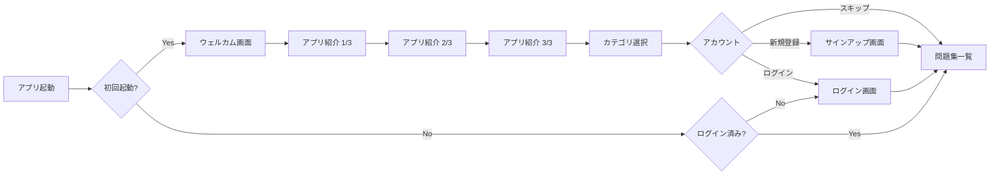
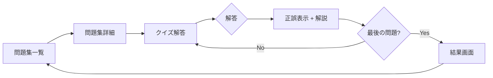
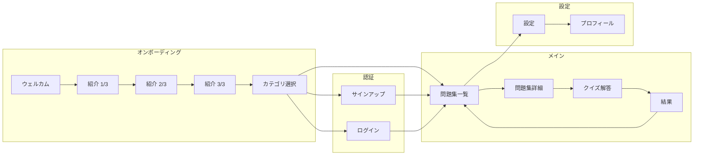

# iOS アプリ

## 画面遷移図

### オンボーディングフロー

```mermaid
flowchart LR
    A[アプリ起動] --> B{初回起動?}
    B -->|Yes| C[ウェルカム画面]
    C --> D[アプリ紹介 1/3]
    D --> E[アプリ紹介 2/3]
    E --> F[アプリ紹介 3/3]
    F --> G[カテゴリ選択]
    G --> H{アカウント}
    H -->|新規登録| I[サインアップ画面]
    H -->|ログイン| J[ログイン画面]
    H -->|スキップ| K[問題集一覧]
    I --> K
    J --> K
    B -->|No| L{ログイン済み?}
    L -->|Yes| K
    L -->|No| J
```

### メインフロー

```mermaid
flowchart LR
    A[問題集一覧] --> B[問題集詳細]
    B --> C[クイズ解答]
    C --> D{解答}
    D --> E[正誤表示 + 解説]
    E --> F{最後の問題?}
    F -->|No| C
    F -->|Yes| G[結果画面]
    G --> A
```

### 全体画面一覧

```mermaid
flowchart LR
    subgraph オンボーディング
        Welcome[ウェルカム]
        Intro1[紹介 1/3]
        Intro2[紹介 2/3]
        Intro3[紹介 3/3]
        CategorySelect[カテゴリ選択]
    end

    subgraph 認証
        SignUp[サインアップ]
        Login[ログイン]
    end

    subgraph メイン
        WorkbookList[問題集一覧]
        WorkbookDetail[問題集詳細]
        Quiz[クイズ解答]
        Result[結果]
    end

    subgraph 設定
        Settings[設定]
        Profile[プロフィール]
    end

    Welcome --> Intro1 --> Intro2 --> Intro3 --> CategorySelect
    CategorySelect --> SignUp
    CategorySelect --> Login
    CategorySelect --> WorkbookList
    SignUp --> WorkbookList
    Login --> WorkbookList
    WorkbookList --> WorkbookDetail --> Quiz --> Result --> WorkbookList
    WorkbookList --> Settings --> Profile
```

## 画面詳細

| 画面 | 状態 | 説明 |
|------|------|------|
| ウェルカム | 実装済み | 初回起動時のウェルカム画面 |
| アプリ紹介 (1-3) | 実装済み | アプリの機能紹介スライド |
| カテゴリ選択 | 実装済み | 学習カテゴリの選択（中学理科・化学基礎・化学・大学一般化学） |
| サインアップ | 実装済み | メール+パスワード（モック） |
| ログイン | 実装済み | メール+パスワード（モック） |
| 問題集一覧 | 実装済み | 問題集のリスト表示（タイトル、説明、問題数） |
| 問題集詳細 | 実装済み | 問題リスト + 「この問題集を解く」ボタン |
| クイズ解答 | 実装済み | 問題文 + 選択肢、正誤表示 + 解説 |
| 結果 | 実装済み | スコア、正誤一覧、一覧に戻る |
| 設定 | 実装済み | カテゴリ変更、アカウント情報、学習統計、ログアウト |
| プロフィール | 実装済み | ユーザー情報、学習記録 |

## 利用イベント計測（Analytics）

リリース後にオンボーディング離脱や主要機能の成功／失敗率をバージョン別に把握するための計測基盤（[#261](https://github.com/takoikatakotako/rikako/issues/261)）。計測基盤は **Firebase Analytics** を採用（クラッシュ収集 [#235](https://github.com/takoikatakotako/rikako/issues/235) の Crashlytics と統合する方針）。

### アーキテクチャ

計測は差し替え可能な抽象に載せている（`LearningRepository` 等と同じ protocol-first）。

| 種別 | ファイル | 役割 |
|------|----------|------|
| protocol | `Domain/Analytics/AnalyticsClient.swift` | 計測の抽象。`log(_:)` / `setCommonProperties(_:)` |
| イベント | `Domain/Analytics/AnalyticsEvent.swift` | 最小イベントの enum ＋ 失敗理由カテゴリ |
| 実装(Noop) | `Infrastructure/Analytics/NoopAnalyticsClient.swift` | preview / UIテスト用 |
| 実装(Console) | `Infrastructure/Analytics/ConsoleAnalyticsClient.swift` | DEBUG でイベントをコンソール出力 |
| 共通プロパティ | `Infrastructure/Analytics/AnalyticsCommonProperties+Current.swift` | app version/build・app slug・OS version |

`AppContainer` が構築して各 ViewModel に注入（DIしている `OnboardingViewModel`）または `AppContainer.shared.analytics` 経由で発火（service-locator の Quiz/AIChat/Transfer 等）する。

### イベント一覧

`app_open` / `onboarding_started` / `onboarding_step_viewed`(step) / `onboarding_completed` / `workbook_started`(workbook_id) / `workbook_completed`(workbook_id) / `answers_submitted`(workbook_id, count) / `answers_submission_failed`(reason) / `ai_chat_started` / `ai_chat_succeeded` / `ai_chat_failed`(reason) / `transfer_started` / `transfer_completed` / `transfer_failed`(reason)

### プライバシー方針（重要）

- イベントに載せるのは**識別子・件数・カテゴリの非 PII スカラーのみ**。ユーザー入力本文・問題文・メールアドレス・Cognito Identity ID は**絶対に含めない**。
- 失敗は生のエラーメッセージではなく `AnalyticsFailureReason`（`network`/`server`/`decoding`/`cancelled`/`unauthorized`/`unknown`）の有限カテゴリに畳み込む。
- 非 PII であることは `RikakoTests/AnalyticsEventTests.swift` で検証（キーの allowlist・値の型・reason の有限集合）。`PrivacyInfo.xcprivacy` は `ProductInteraction` を宣言済み。

### 実装フェーズ

- **Phase 1（実装済み）**: Firebase 非依存の計測レイヤー＋全イベント発火＋PIIテスト。DEBUG は `ConsoleAnalyticsClient`、Release は `NoopAnalyticsClient`。
- **Phase 2（Firebase 結線・未）**:
  1. Firebase プロジェクトを作成し、**prod の iOS アプリ2つ**を登録（`jp.conol.chemist` / `org.rikako.it-passport`）
  2. `GoogleService-Info.plist` をDL（bundle IDごと）。**AdId 収集を無効化**し `NSPrivacyTracking=false` を維持
  3. `firebase-ios-sdk` を SPM 追加、`FirebaseAnalyticsClient` を実装、`RikakoApp` で `FirebaseApp.configure()`
  4. `AppContainer` の Release 実装を `NoopAnalyticsClient` → `FirebaseAnalyticsClient` に差し替え（dev フレーバーは Noop 継続）
  5. Firebase DebugView で個人情報が送信されていないことを確認

#### GoogleService-Info.plist の扱い（git に載せない）

`GoogleService-Info.plist` は本来クライアント配布物だが、`API_KEY` がシークレットスキャナに毎回検知され通知ノイズになるため、**git 管理外**とする（`.gitignore` で `**/GoogleService-Info*.plist` を除外済み）。

- **ローカル**: Firebase コンソールからDLした plist を配置する（配置先は Phase 2 で SPM/plist 選択方式を実装する際に確定。bundle ID ごとに別ファイル）。紛失しても再DL可。
- **CI**: base64 を GitHub Actions Secret に格納し、ビルド前に復元するステップを追加する（Phase 2 の Firebase 結線とセットで導入。Firebase 未結線の現状はビルドに plist 不要）。
