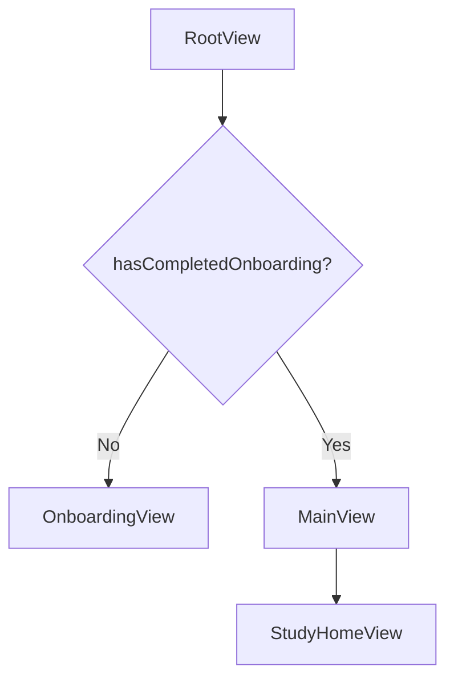

# iOS Architecture

## 目的

`ios/Rikako` のディレクトリ構成と責務を整理するためのメモです。

- 関連ドキュメント: [README.md](./README.md)
- 関連ドキュメント: [navigation.md](./navigation.md)
- 関連ドキュメント: [onboarding.md](./onboarding.md)

現在の方針は、画面から直接 API を呼ばず、次の依存方向で組むことです。

```text
Screen (View)
  -> ViewModel
    -> UseCase
      -> Repository
        -> Infrastructure
```

## ディレクトリ構成

```text
ios/Rikako/
  AppContainer.swift
  AppState.swift
  RikakoApp.swift

  Domain/
    Entity/
    Repository/
    UseCase/

  Data/
    Remote/
      Request/
      Response/
    Repository/

  Infrastructure/
    Identity/
    Network/

  Screen/
    Root/
    Main/
    Onboarding/
    StudyHome/
    StudyRecord/
    MyPage/
    Settings/
```

補助的に、まだ feature ディレクトリへ移し切っていない画面もあります。

- `Screen/QuizView.swift`
- `Screen/ResultView.swift`
- `Screen/ProfileView.swift`
- `Screen/WrongAnswersView.swift`
- `Screen/NotificationsView.swift`
- `Screen/HelpAndSupportView.swift`
- `Screen/LegacyTopView.swift`
- `Screen/LegacyCategoryViews.swift`
- `Screen/WorkbookListView.swift`
- `Screen/WorkbookDetailView.swift`

## 各レイヤの責務

### Screen

SwiftUI の View を置く層です。

- 表示とユーザー操作の受け取りに集中する
- 初回読み込みは `task` などから ViewModel を呼ぶ
- API や Repository を直接触らない

feature ごとにディレクトリを切り、必要なら同階層に ViewModel を置きます。

例:

- [RootView.swift](/Users/jumpei.ono/MyProject/rikako/ios/Rikako/Screen/Root/RootView.swift)
- [MainView.swift](/Users/jumpei.ono/MyProject/rikako/ios/Rikako/Screen/Main/MainView.swift)
- [StudyHomeView.swift](/Users/jumpei.ono/MyProject/rikako/ios/Rikako/Screen/StudyHome/StudyHomeView.swift)

### ViewModel

画面状態と画面単位の処理を持つ層です。

- `isLoading`
- `errorMessage`
- fetched data
- 画面表示向けの整形
- 初回 fetch

ViewModel は `Observation` の `@Observable` を使います。

例:

- [OnboardingViewModel.swift](/Users/jumpei.ono/MyProject/rikako/ios/Rikako/Screen/Onboarding/OnboardingViewModel.swift)
- [StudyHomeViewModel.swift](/Users/jumpei.ono/MyProject/rikako/ios/Rikako/Screen/StudyHome/StudyHomeViewModel.swift)
- [StudyRecordViewModel.swift](/Users/jumpei.ono/MyProject/rikako/ios/Rikako/Screen/StudyRecord/StudyRecordViewModel.swift)

### Domain/Entity

アプリの中心概念を置く層です。

- `Question`
- `Workbook`
- `Category`
- `AnswerItem`

View 都合でも API 都合でもなく、アプリで扱う意味のあるデータを置きます。

例:

- [Question.swift](/Users/jumpei.ono/MyProject/rikako/ios/Rikako/Domain/Entity/Question.swift)
- [Workbook.swift](/Users/jumpei.ono/MyProject/rikako/ios/Rikako/Domain/Entity/Workbook.swift)

### Domain/UseCase

画面がやりたいことを明示する層です。

- 問題集一覧を取る
- 問題集詳細を取る
- カテゴリ一覧を取る
- 回答を送る

複数画面で共通化したい操作はここに置きます。

例:

- [LearningUseCases.swift](/Users/jumpei.ono/MyProject/rikako/ios/Rikako/Domain/UseCase/LearningUseCases.swift)

### Domain/Repository

データ取得の抽象です。

ViewModel / UseCase から見ると、どこからデータが来るかを隠します。

例:

- [LearningRepository.swift](/Users/jumpei.ono/MyProject/rikako/ios/Rikako/Domain/Repository/LearningRepository.swift)

### Data/Remote

API や配信 JSON の request/response モデルを置く層です。

`DTO` ではなく、役割が分かるように `Request` / `Response` で分けています。

例:

- [AnswerSubmissionRequest.swift](/Users/jumpei.ono/MyProject/rikako/ios/Rikako/Data/Remote/Request/AnswerSubmissionRequest.swift)
- [WorkbookListResponse.swift](/Users/jumpei.ono/MyProject/rikako/ios/Rikako/Data/Remote/Response/WorkbookListResponse.swift)
- [CategoryListResponse.swift](/Users/jumpei.ono/MyProject/rikako/ios/Rikako/Data/Remote/Response/CategoryListResponse.swift)
- [AnswerSubmissionResponse.swift](/Users/jumpei.ono/MyProject/rikako/ios/Rikako/Data/Remote/Response/AnswerSubmissionResponse.swift)

### Data/Repository

Repository protocol の実装です。

現在は remote から取得する実装を置いています。

例:

- [RemoteLearningRepository.swift](/Users/jumpei.ono/MyProject/rikako/ios/Rikako/Data/Repository/RemoteLearningRepository.swift)

### Infrastructure

HTTP や device identity など、外部 I/O の詳細を置く層です。

例:

- [HTTPClient.swift](/Users/jumpei.ono/MyProject/rikako/ios/Rikako/Infrastructure/Network/HTTPClient.swift)
- [DeviceIdentityProvider.swift](/Users/jumpei.ono/MyProject/rikako/ios/Rikako/Infrastructure/Identity/DeviceIdentityProvider.swift)

### AppContainer

依存を束ねる composition root です。

例:

- [AppContainer.swift](/Users/jumpei.ono/MyProject/rikako/ios/Rikako/AppContainer.swift)

ここで Repository 実装を組み立てて UseCase を作ります。

### AppState

画面横断の小さい shared state だけを持つ層です。

現在保持しているもの:

- オンボーディング完了状態
- ログイン状態
- 選択中の問題集 ID
- 学習結果の簡易サマリ
- 間違えた問題

例:

- [AppState.swift](/Users/jumpei.ono/MyProject/rikako/ios/Rikako/AppState.swift)

画面固有の fetched data や loading 状態は AppState に置かず、ViewModel に置きます。

## Root からの流れ

現在の画面遷移の起点は `RootView` です。



詳細は [navigation.md](./navigation.md) を参照してください。

## モックが残っている場所

現状、問題系の取得は実 API / 実 JSON を使っていますが、周辺機能は仮実装が残っています。

### 実データ

- 問題集一覧
- 問題集詳細
- カテゴリ一覧
- カテゴリ詳細
- 回答送信 API

### 仮実装

- 学習記録の集計
  - [AppState.swift](/Users/jumpei.ono/MyProject/rikako/ios/Rikako/AppState.swift)
  - [StudyRecordViewModel.swift](/Users/jumpei.ono/MyProject/rikako/ios/Rikako/Screen/StudyRecord/StudyRecordViewModel.swift)
- マイページのショートカットやフッター
  - [MyPageViewModel.swift](/Users/jumpei.ono/MyProject/rikako/ios/Rikako/Screen/MyPage/MyPageViewModel.swift)
- お知らせ一覧
  - [NotificationsView.swift](/Users/jumpei.ono/MyProject/rikako/ios/Rikako/Screen/NotificationsView.swift)
- FAQ / お問い合わせ
  - [HelpAndSupportView.swift](/Users/jumpei.ono/MyProject/rikako/ios/Rikako/Screen/HelpAndSupportView.swift)
- Preview 用固定データ
  - [MockData.swift](/Users/jumpei.ono/MyProject/rikako/ios/Rikako/MockData.swift)

## 運用ルール

- View から `UseCase` や `Repository` を直接呼ばない
- 初回 fetch は ViewModel で行う
- 画面横断状態だけを `AppState` に置く
- API request/response は `Data/Remote/Request` と `Data/Remote/Response` に置く
- アプリの中心データは `Domain/Entity` に置く
- 新しい画面は `Screen/<Feature>/` を作って、その中に `View` と `ViewModel` を置く

## 今後の整理候補

- `Screen/` 直下の画面を feature ディレクトリへ移す
- `Remote/Response` と `Entity` の mapper を明示的に分ける
- `WrongAnswers` や `Result` も ViewModel 経由へ寄せる
- 学習記録やお知らせを仮実装から本実装へ置き換える
