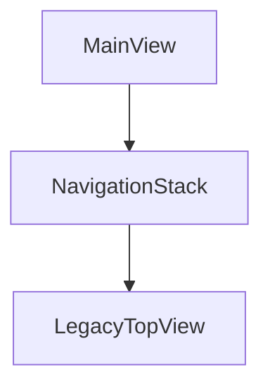
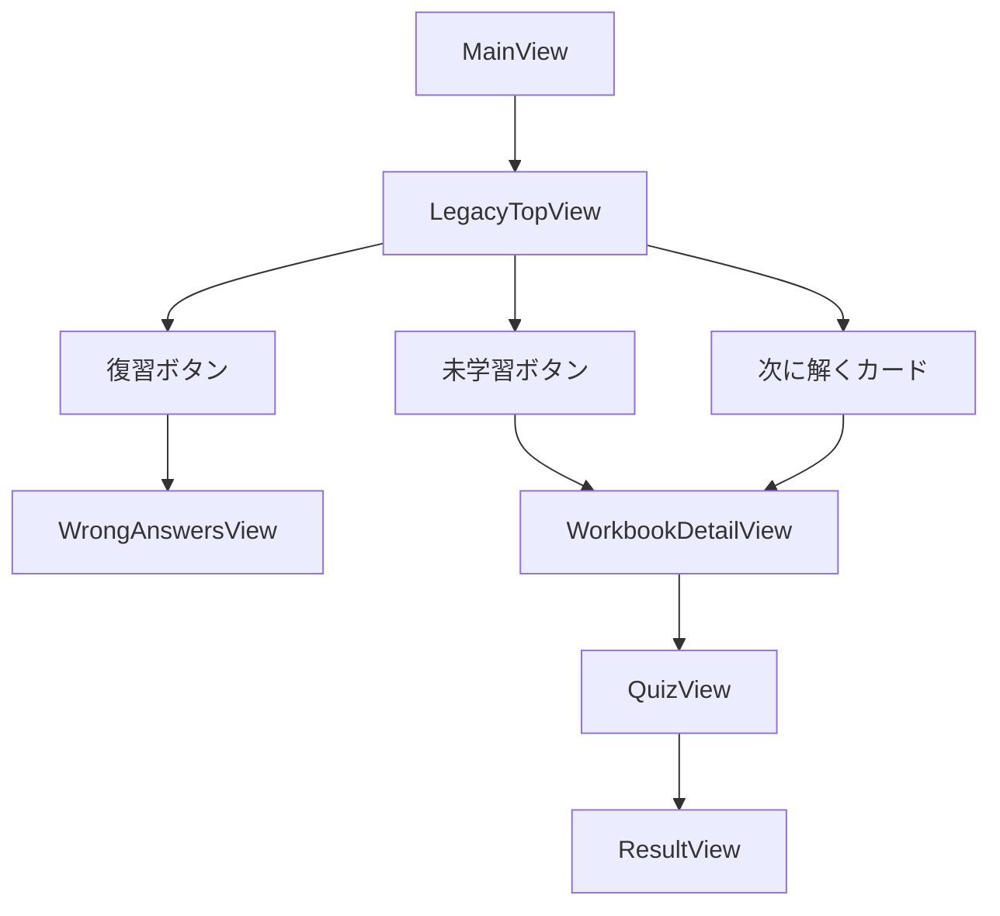

# iOS Navigation

## 概要

- 関連ドキュメント: [README.md](/Users/jumpei.ono/MyProject/rikako/docs/ios/README.md)
- 関連ドキュメント: [architecture.md](/Users/jumpei.ono/MyProject/rikako/docs/ios/architecture.md)
- エントリーポイントは `RootView`
- `AppState` の状態に応じて `OnboardingView` または `MainView` を出し分ける
- `MainView` の直下は `NavigationStack` で、最初に `LegacyTopView` を表示する

## Root からの分岐

```mermaid
flowchart TD
    A[RootView] --> B{hasCompletedOnboarding?}
    B -- No --> C[OnboardingView]
    B -- Yes --> D[MainView]

    C --> G[オンボーディング完了]
    G --> H[appState.completeOnboarding()]
    H --> D
```

## MainView 配下



## MainView からの主な遷移



## 補足
- 現在はオンボーディング完了後、そのまま `MainView` に入る
- `LoginView` と `SignUpView` は残っているが、Root の初期遷移では使っていない
- 画面遷移の中心は `LegacyTopView -> WorkbookDetailView -> QuizView -> ResultView`
- レイヤ構成やディレクトリ責務は [architecture.md](/Users/jumpei.ono/MyProject/rikako/docs/ios/architecture.md) を参照
- オンボーディング仕様は [onboarding.md](/Users/jumpei.ono/MyProject/rikako/docs/ios/onboarding.md) を参照
