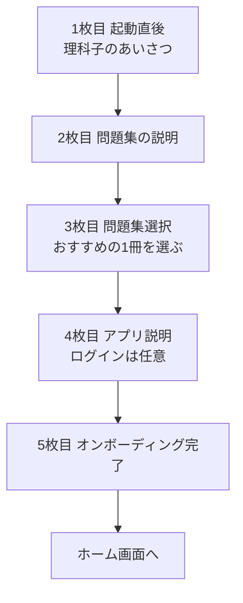

# iOS Onboarding

## 関連ドキュメント

- [README.md](/Users/jumpei.ono/MyProject/rikako/docs/ios/README.md)
- [architecture.md](/Users/jumpei.ono/MyProject/rikako/docs/ios/architecture.md)
- [navigation.md](/Users/jumpei.ono/MyProject/rikako/docs/ios/navigation.md)

## 目的
- 初回起動時にキャラクターとアプリの世界観を伝える
- 最初の学習導線として問題集を1つ選ばせる
- ログインを必須にせず、まず使い始められる安心感を出す

## フロー
1. あいさつ
2. 問題集の説明
3. 最初の問題集選択
4. アプリの説明
5. 学習開始

## 1枚目 起動直後画面
### 画面の役割
- キャラクターとアプリの雰囲気を伝える
- 学習アプリであることを最初に理解してもらう

### 表示内容
- 理科子
  - 亀の女の子のキャラクター
- メッセージ
  - こんにちは、理科子です！
  - このアプリは高校生向けの化学を楽しく学ぶためのアプリです！
  - 一緒に楽しく勉強していこうね！

### UI イメージ
- 画面上部から中央にかけて理科子を大きく表示
- 下部に歓迎メッセージ
- CTA は `次へ`

## 2枚目 問題集について説明
### 画面の役割
- 高校化学には分野があることを伝える
- 次ページの「問題集選択」に意味を持たせる

### 表示内容
- メッセージ
  - とはいえ高校化学とはいえ、範囲や分野もいろいろあるから、君にあった分野を選んでいこう！
  - 次のページで問題集を選択できるから、学びたい問題集を選んでみてね。
  - 特になければおすすめの基礎の問題集を選んでみよう！

### UI イメージ
- 理科子の補助イラストを小さめに表示
- メッセージ中心の説明画面
- CTA は `次へ`

## 3枚目 問題集選択画面
### 画面の役割
- 初回学習の起点になる問題集を1つ選ばせる
- 初回の迷いを減らす

### 表示内容
- セクション
  - `おすすめ`
- 問題集
  - おすすめの問題集を1つだけ表示
- ユーザー操作
  - その問題集を選択する

### UI イメージ
- カード形式で問題集を1件表示
- 問題集名、簡単な説明、問題数を表示
- 選択後は `次へ` ではなく自動遷移でもよい

### 補足
- 問題集を選ばないと次に進めない設計にする
- 初期値としては基礎の問題集をおすすめに置く

## 4枚目 アプリの説明
### 画面の役割
- 他の機能は使いながら覚えればよいと伝える
- ログインは任意であることを明示する

### 表示内容
- メッセージ
  - 選びおわったね、他の機能は使いながら覚えていこうね！
  - このアプリはログインしなくても使えるけど、ログインすると他の端末でも学習記録を共有できるからよかったらログインして使ってみてね！

### UI イメージ
- 選択完了の達成感がある見せ方
- ログイン導線を強制せず、補足として見せる
- CTA は `次へ`

## 5枚目 オンボーディング完了
### 画面の役割
- 学習開始の後押しをする
- 気持ちよくホーム画面に遷移させる

### 表示内容
- メッセージ
  - それではさっそく勉強していこう！
  - 一緒に頑張ろうね！

### UI イメージ
- 理科子をもう一度大きく表示
- CTA は `はじめる`

## 実装メモ
- オンボーディングは全5画面
- 3枚目だけ説明ではなく選択操作を含む
- ログインはオンボーディング中に必須化しない
- 選択した問題集は初期ホーム表示やおすすめ表示に利用できる
- 現在の Root からの遷移は [navigation.md](/Users/jumpei.ono/MyProject/rikako/docs/ios/navigation.md) を参照
- レイヤ構成や責務分担は [architecture.md](/Users/jumpei.ono/MyProject/rikako/docs/ios/architecture.md) を参照

## 今後の検討
- 3枚目の問題集選択を完全な別画面にするか、オンボーディング内の1ページとして見せるか
- 問題集選択後に即クイズ開始するか、いったんホームに戻すか
- 理科子の立ち絵や表情差分をどこまで使うか
