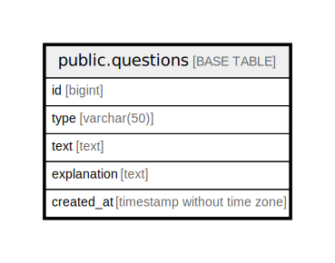

# public.questions

## Description

## Columns

| Name | Type | Default | Nullable | Children | Parents | Comment |
| ---- | ---- | ------- | -------- | -------- | ------- | ------- |
| id | bigint | nextval('questions_id_seq'::regclass) | false |  |  |  |
| type | varchar(50) |  | false |  |  |  |
| text | text |  | false |  |  |  |
| explanation | text |  | true |  |  |  |
| created_at | timestamp without time zone | CURRENT_TIMESTAMP | true |  |  |  |

## Constraints

| Name | Type | Definition |
| ---- | ---- | ---------- |
| questions_id_not_null | n | NOT NULL id |
| questions_text_not_null | n | NOT NULL text |
| questions_type_not_null | n | NOT NULL type |
| questions_pkey | PRIMARY KEY | PRIMARY KEY (id) |

## Indexes

| Name | Definition |
| ---- | ---------- |
| questions_pkey | CREATE UNIQUE INDEX questions_pkey ON public.questions USING btree (id) |

## Relations

---

> Generated by [tbls](https://github.com/k1LoW/tbls)
